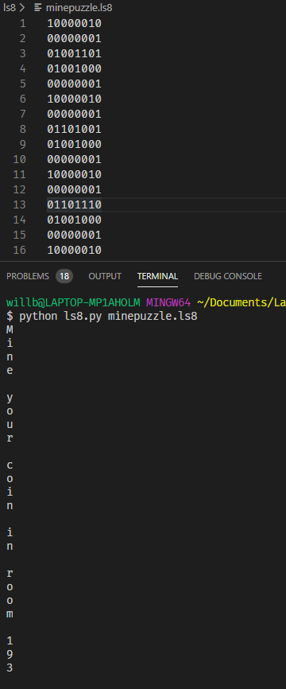

# Treasure Hunter

- This project is the client for a treasure hunt challenge. Link to challenge repo [here](https://github.com/LambdaSchool/CS-Build-Week-2)

- This client has been created using React.js, and gives the user access to a variety of different abilities related to the challenge, as well as a visual representation of the map, as well as where their player is.

- The ls8 folder contains a cpu emulator that can run varous binary op codes, which comes in handy when it comes time to find the correct room to  mine a coin from the block chain.
